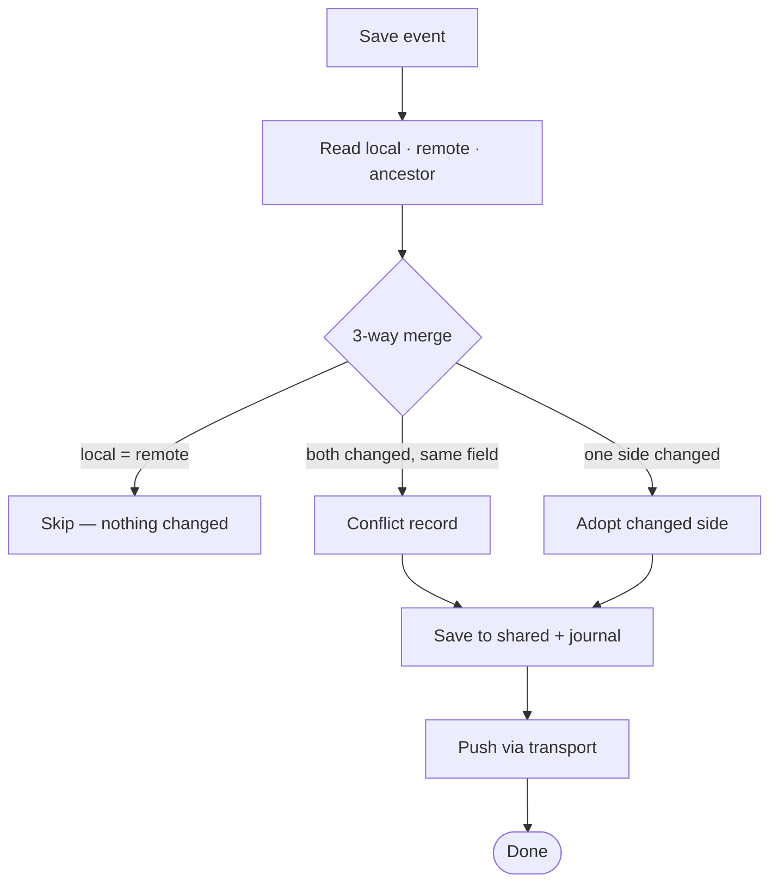
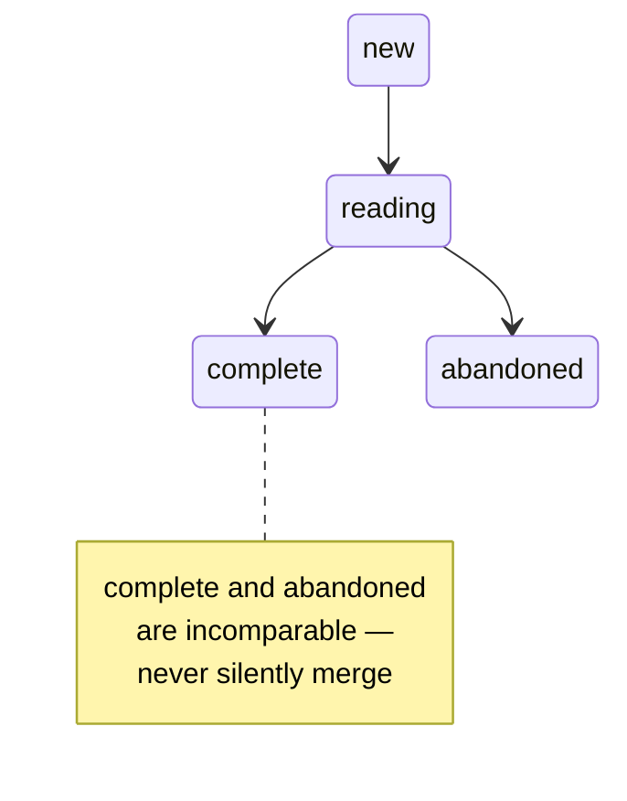

<div align="center">

<svg xmlns="http://www.w3.org/2000/svg" viewBox="0 0 419.3 120.3" width="419.3" height="120.3" role="img" aria-label="Syncery">
  <defs>
    <linearGradient id="g" x1="16.0" y1="0" x2="397.3" y2="0" gradientUnits="userSpaceOnUse">
      <stop offset="0" stop-color="#00A38C"/><stop offset="1" stop-color="#0A86CF"/>
    </linearGradient>
  </defs>
  <g fill="url(#g)">
    <path d="M36.85 82.46Q31.78 82.46 27.75 80.81Q23.72 79.16 21.31 75.94Q18.91 72.70 18.77 68.14L30.79 68.14Q31.05 70.72 32.56 72.07Q34.09 73.42 36.52 73.42Q39.04 73.42 40.48 72.27Q41.94 71.11 41.94 69.07Q41.94 67.35 40.78 66.23Q39.63 65.11 37.95 64.39Q36.26 63.65 33.16 62.73Q28.67 61.34 25.83 59.96Q22.99 58.57 20.95 55.87Q18.91 53.16 18.91 48.80Q18.91 42.34 23.59 38.68Q28.27 35.01 35.80 35.01Q43.45 35.01 48.13 38.68Q52.83 42.34 53.16 48.87L40.95 48.87Q40.81 46.63 39.30 45.34Q37.78 44.05 35.41 44.05Q33.36 44.05 32.10 45.14Q30.85 46.23 30.85 48.28Q30.85 50.52 32.96 51.77Q35.08 53.02 39.56 54.48Q44.05 55.99 46.86 57.38Q49.66 58.77 51.70 61.41Q53.75 64.05 53.75 68.20Q53.75 72.16 51.73 75.40Q49.72 78.64 45.90 80.56Q42.07 82.46 36.85 82.46ZM112.58 35.67L96.54 66.69L96.54 82.00L85.25 82.00L85.25 66.69L69.22 35.67L82.02 35.67L91.00 55.07L99.91 35.67L112.58 35.67ZM173.12 82.00L161.84 82.00L142.96 53.42L142.96 82.00L131.68 82.00L131.68 35.67L142.96 35.67L161.84 64.38L161.84 35.67L173.12 35.67L173.12 82.00ZM190.30 58.77Q190.30 51.91 193.27 46.52Q196.24 41.14 201.55 38.14Q206.87 35.14 213.59 35.14Q221.84 35.14 227.72 39.50Q233.60 43.85 235.58 51.37L223.16 51.37Q221.78 48.47 219.23 46.96Q216.70 45.43 213.47 45.43Q208.25 45.43 205.01 49.06Q201.79 52.69 201.79 58.77Q201.79 64.84 205.01 68.47Q208.25 72.10 213.47 72.10Q216.70 72.10 219.23 70.58Q221.78 69.07 223.16 66.16L235.58 66.16Q233.60 73.69 227.72 78.01Q221.84 82.33 213.59 82.33Q206.87 82.33 201.55 79.33Q196.24 76.33 193.27 70.99Q190.30 65.63 190.30 58.77ZM265.96 44.71L265.96 54.08L281.07 54.08L281.07 62.80L265.96 62.80L265.96 72.96L283.05 72.96L283.05 82.00L254.67 82.00L254.67 35.67L283.05 35.67L283.05 44.71L265.96 44.71ZM325.77 82.00L316.14 64.51L313.43 64.51L313.43 82.00L302.15 82.00L302.15 35.67L321.09 35.67Q326.57 35.67 330.43 37.58Q334.29 39.49 336.20 42.83Q338.12 46.16 338.12 50.26Q338.12 54.88 335.51 58.51Q332.90 62.14 327.82 63.65L338.51 82.00L325.77 82.00ZM313.43 56.53L320.43 56.53Q323.53 56.53 325.07 55.01Q326.63 53.49 326.63 50.71Q326.63 48.07 325.07 46.56Q323.53 45.04 320.43 45.04L313.43 45.04L313.43 56.53ZM397.34 35.67L381.29 66.69L381.29 82.00L370.01 82.00L370.01 66.69L353.97 35.67L366.77 35.67L375.75 55.07L384.66 35.67L397.34 35.67Z"/>
    <circle cx="34.88" cy="101.00" r="3.3"/><circle cx="90.67" cy="101.00" r="3.3"/><circle cx="150.35" cy="101.00" r="3.3"/><circle cx="211.85" cy="101.00" r="3.3"/><circle cx="266.82" cy="101.00" r="3.3"/><circle cx="318.28" cy="101.00" r="3.3"/><circle cx="375.42" cy="101.00" r="3.3"/>
  </g>
  <path d="M10.00 101.00 L403.34 101.00" fill="none" stroke="url(#g)" stroke-width="1.6" stroke-linecap="round" opacity="0.45"/>
</svg>

[](https://github.com/d0nizam/syncery.koplugin/releases)
[](LICENSE)


**Cross-device reading progress, annotations, metadata, and render-settings sync for KOReader.**

<em><b>S</b>ynchronise <b>Y</b>our <b>N</b>otes, <b>C</b>onnect <b>E</b>-readers, <b>R</b>ead <b>Y</b>our way.</em>

Syncery synchronises per-device reading data across all your KOReader devices — via Syncthing or cloud storage (Dropbox/WebDAV/FTP). A 3-way merge engine resolves concurrent annotation edits, a Trash Bin recovers deleted ones, and per-field merge keeps progress, metadata, and render settings in step across devices.

**New here?** Start with the **[Setup &amp; Sync Guide](SETUP.md)** — how to set up Syncthing or cloud sync from scratch.

</div>

---

## Contents

- **[Setup &amp; Sync Guide](SETUP.md)** — start here if you're setting things up
- [Features](#features)
- [Supported devices](#supported-devices)
- [Installation](#installation)
- [First-time setup](#first-time-setup)
- [Storage modes](#storage-modes)
- [What Syncery syncs](#what-syncery-syncs)
- [Menu reference](#menu-reference)
- [Transports](#transports)
- [Conflict resolution](#conflict-resolution)
- [Lifecycle events](#lifecycle-events)
- [Translations](#translations)
- [Settings reference](#settings-reference)
- [Architecture overview](#architecture-overview)
- [Troubleshooting](#troubleshooting)
- [License](#license)

---

## Features

Syncery keeps your reading life in step across every KOReader device — self-hosted, with no account and no third-party server in the middle.

- **Reading position** — start a book on one device and pick up exactly where you left off on another. When a device is further ahead, Syncery offers to jump you there — your choice of automatic, ask first, or never.
- **Highlights, notes & bookmarks** — your annotations follow you everywhere. Deleted ones go to a **Trash Bin** you can restore from.
- **Book details** — reading status (Reading / On hold / Finished), star rating, collections, your summary note, a custom title or author, and a handmade table of contents all stay in sync.
- **Font & layout** — optionally sync per-book font and margins too. Off by default, since a size that's comfortable on a phone is wrong on a large e-reader.
- **Your files, your transport** — everything travels as plain JSON over **Syncthing** (direct device-to-device) or your own **cloud** (Dropbox / WebDAV / FTP). Nothing is stored on a Syncery server, because there isn't one.
- **Nothing lost when devices disagree** — edits made on different devices merge instead of overwriting each other. The one case that can truly clash — marking a book *Finished* on one device and *On hold* on another — is surfaced for you to resolve, never dropped silently.
- **Works offline** — changes sync whenever your devices next reconnect; a device that's been offline for weeks keeps its place.
- **See everything in one place** — a **Progress Browser** shows how far each device has read in every book (and jumps you to any of them), and an **Annotation Browser** gathers all your highlights and notes across your whole library.

For the exact fields and toggles, see [What Syncery syncs](#what-syncery-syncs); for how it's built, see [Architecture overview](#architecture-overview).

---

## Supported devices

Any device that runs a reasonably recent version of KOReader:

| Platform | Notes |
|----------|-------|
| Kindle | Paperwhite, Oasis, Scribe, Basic |
| Kobo | Libra, Clara, Elipsa |
| PocketBook | Any KOReader-capable model |
| Android | Phones and tablets |
| Linux | x86_64 and aarch64 |

Syncery writes JSON files to disk — it does not manage its own daemon.
Data replication is handled by the transport (Syncthing or Cloud), so any
device that can run KOReader and one of those transports can participate.

---

## Installation

### Manual ZIP

1. Download the latest `syncery.koplugin.zip` from [Releases](../../releases).
2. Extract `syncery.koplugin/` into your KOReader plugins directory:

   | Device | Plugins directory |
   |--------|-------------------|
   | Kobo | `/mnt/onboard/.adds/koreader/plugins/` |
   | Kindle | `/mnt/us/koreader/plugins/` |
   | Android | `/koreader/plugins/` |

3. Restart KOReader. The plugin appears as **Syncery** in **☰ → Tools**.

### Updating

Once installed, Syncery can update itself: open **Syncery → Check for plugin
updates** (below *Advanced*). It checks GitHub for a newer release, shows the
notes, installs it in place, and offers to restart.

### Dependencies

The plugin itself has no runtime dependencies beyond KOReader. Each transport
needs its backend:

- **Syncthing** — a running Syncthing daemon with REST API access
  (via the KOSyncthing+ plugin, Termux, or a desktop install).
- **Cloud** — KOReader's built-in SyncService or hius07's "Cloud storage+"
  plugin with a configured service (Dropbox/WebDAV/FTP).

---

## First-time setup

The first-run wizard (triggers automatically on first load) walks through up
to 5 steps in a single centred panel:

### 1 — Choose a transport

Pick how this device will sync: **Syncthing** (peer-to-peer, eventually
consistent), **Cloud** (request-response, Dropbox/WebDAV/FTP), or **Decide
later** (save your data locally now and pick a transport afterwards). If
KOSyncthing+ is installed, the Syncthing row offers auto-discovery.

### 2 — Enter API key (Syncthing only)

If you chose Syncthing *without* KOSyncthing+, an `InputDialog` asks for the
Syncthing REST API key. This step is skipped otherwise.

### 3 — Choose what to sync

Toggle **progress** and **annotations**. Both are off by default — consent-first, so nothing syncs until you turn it on. (Finer
controls — metadata, render settings, annotation sub-toggles — live in the menu
under *What's synced* after setup.)

### 4 — Name this device

Set a human-readable label that other devices will see (e.g. "Kindle
Paperwhite"). Shown in the status panel and in every merge record.

### 5 — Review and confirm

A recap step shows all choices. Tap **Done** to save and start syncing.

The wizard can be re-triggered from **Advanced** at any time.

---

## Storage modes

> **SDR (default)**
> *Write:* `<book>.sdr/<book>.syncery-annotations.json`
> *Rule:* follows KOReader's "Book metadata location" (the book's sidecar directory)
> *Read:* canonical location, with a fallback across KOReader's three metadata locations (book folder / docsettings / hashdocsettings)
> *Best for:* users who want Syncery to follow their existing KOReader setup
>
> **Synceryhash**
> *Write:* `<settings>/syncery/synceryhash/<shard>/<book_md5>/syncery-annotations.json`
> *Rule:* content-addressed (same book = same path on every device)
> *Read:* single location (no fallback needed)
> *Best for:* users who want a known, separate location to sync
>
> **Don't confuse the two "hash" ideas:** *Synceryhash* is where Syncery keeps **its own** files. KOReader's **hashdocsettings** is a separate setting — one of the three places KOReader keeps **its** native `.sdr`, and just one of the locations the SDR mode above follows. You don't need hashdocsettings to use Synceryhash.
>
> **Both modes share (private, never synced):**
> * `last_sync/<book_md5>/` — the per-device ancestor used for 3-way merge
> * `cloud_staging/` — upload staging
> * `sync-journal.ndjson` — merge event log
> * `syncery_activity.json` — recent-activity record
>
> **Migration:** run-once, idempotent, moves shared files only. Advanced → Storage mode.

---

## What Syncery syncs

| Category | What gets saved | Merge strategy | UI toggles |
|----------|----------------|----------------|------------|
| **Reading progress** | Per-device: `(percent, page, total_pages, xpath, revision, timestamp, device_id)` | Last-write-wins by `(revision, timestamp)` | Master toggle |
| **Annotations** | Highlights, notes, bookmarks — each with colour, drawer, timestamps, device_id | 3-way merge with tombstone tracking | Master toggle + highlights/notes/bookmarks sub-toggles (each filters its own type; a disabled type stays local and is preserved for other devices in the shared file) + file-extension filter |
| **Book metadata** | Reading status, rating, collections, summary note, custom title/author, handmade TOC | Per-field last-write-wins; status uses the lifecycle lattice | Master toggle + per-field sub-toggles |
| **Render settings** | Font face, font size, line spacing, font weight, page margins | Per-field last-write-wins | Master toggle (off by default) + per-field sub-toggles |

---

## Menu reference

Syncery lives under **☰ → Tools**. The full tree:

<details>
<summary><b>Menu tree (from the source)</b></summary>

```
Syncery                                         ← top-level entry in ☰ → Tools
│
├── ⚠ Reading status differs — tap to resolve   ← only when the open book's status conflicts across devices
│
├── [smart status header]                       ← one-line status summary
│   • greyed out when everything is fine
│   • "⚠ … — tap to resolve" when a transport needs attention
│   • rightmost badge: current reading % (when a book is open)
│
├── Sync this book                              ← per-book sync on/off (when a book is open)
├── Sync now                                    ← trigger a sync right now
│
├── What's synced ▸                             ← label adapts live
│   ├── Reading position                        ← progress on/off
│   ├── ── synced both ways ──
│   ├── [annotations] ── Sync specific types ──:  Highlights · Notes · Bookmarks
│   │        + Trash Bin (deleted annotations)…
│   ├── ── Choose which metadata to sync ──  + Push this book's handmade TOC
│   ├── Font & layout…                          ← render settings (── Choose which settings to sync ──)
│   ├── ── on this device ──
│   ├── Adapt highlight style to this device
│   └── Jump: Jump automatically / Ask first / Never jump   (+ Jump to another device now…)
│
├── Transports ▸
│   ├── Configure Syncthing… ▸                  ← Set up API key… · Choose Syncthing folder · Test connection · Advanced (port)
│   └── Cloud settings ▸                         ← pick destination · Clear destination · Check cloud settings · debounce window
│
├── Progress Browser                            ← how far every device has read in each book; jump to any device
├── Annotation Browser                          ← browse all synced highlights and notes across every book
│
├── This book ▸                                 ← only when a document is open
│   ├── Undo last jump
│   ├── Delete annotations only (keeps progress)
│   └── Full reset – mark all as deleted (all devices)
│
├── Tools ▸
│   ├── ── Your Syncery data ──
│   ├── Sync pre-Syncery annotations…           ← bulk import from KOReader
│   ├── Manage all synced books…
│   ├── Remove orphaned sync files…
│   ├── Recent sync activity
│   ├── Syncthing ▸                             ← Rescan all Syncthing folders · KOSyncthing+ integration status…
│   ├── Cloud ▸                                 ← cloud maintenance · Clean cloud upload staging
│   └── Copy diagnostic info
│
├── Advanced ▸
│   ├── Storage mode: Book metadata folder (SDR) / Synceryhash   (+ Migrate all books to this storage mode…)
│   ├── This device: rename · Show QR code
│   ├── Book data save interval
│   └── Delete and reset ▸                      ← Deep clean – permanently erase all book data… · Reset all Syncery settings…
│
└── Check for plugin updates                    ← fetch the latest release from GitHub
```

</details>

---

## Transports

Syncery writes plain-JSON files; a transport replicates them. Two are supported: **Syncthing** (peer-to-peer, eventually consistent) and **Cloud** (Dropbox/WebDAV/FTP via KOReader's SyncService or Cloud storage+, immediately consistent). Both implement the same contract — `id`, `push`, `status` — so the orchestrator drives them identically.

<details>
<summary><b>Per-transport detail + comparison</b></summary>

### Syncthing

Peer-to-peer encrypted file replication via the Syncthing REST API. Configured
under **Transports → Configure Syncthing…**:

- **API key** — *Set up API key…* stores the Syncthing REST API key. Not needed
  when KOSyncthing+ is detected (it supplies the key).
- **Folder** — *Choose Syncthing folder* asks the daemon for its folder list and
  lets you pick one. That folder is the scan root for book discovery and
  `.stignore` placement.
- **Host** — fixed to `127.0.0.1`: the daemon runs locally, watching the files
  Syncery writes. *Advanced* exposes only the port, for non-standard setups.
- **Test connection** — pings the daemon and validates the API key.
- **KOSyncthing+** — when installed, it is auto-detected for URL + API key +
  folder discovery.
- **`.stignore` suppression** — `*syncery-*sync-conflict-*` is written into
  `.stignore` at the folder root. Non-blocking, idempotent, merge-safe, and
  works even when the daemon is down.
- **Eventually consistent** — push is fire-and-forget; the daemon replicates
  asynchronously.

### Cloud

Uses KOReader's built-in SyncService or hius07's Cloud storage+ plugin.
Configured under **Transports → Cloud settings**:

- **Destination** — pick or change where Syncery uploads its JSON files
  (Dropbox/WebDAV/FTP, via the chosen backend).
- **Clear destination** — forget the saved destination on this device only; no
  cloud files are deleted.
- **Check cloud settings** — confirms a destination is set. Reachability is
  verified on the next sync.
- **Debounce window** — how long to wait after a save before uploading.
- **Immediately consistent** — upload returns a real HTTP response code.
- **Staging + upload** — writes to a staging directory; the backend uploads
  asynchronously, with quiet toast suppression during background sync.

### Common interface

| Aspect | Syncthing | Cloud |
|--------|-----------|-------|
| **Backend** | Syncthing daemon (local) | KOReader SyncService / Cloud storage+ |
| **Transport** | REST API (HTTP/HTTPS) | Provider-specific (WebDAV, FTP, Dropbox API) |
| **Consistency** | Eventual (push fire-and-forget) | Immediate (HTTP response) |
| **Folder / destination** | Pick from the live folder list | Pick the destination via the backend |
| **Conflict copies** | Possible (`.sync-conflict-*`) | Never (request-response) |
| **Auth** | API key (manual / KOSyncthing+ / config.xml) | Backend credentials |
| **.stignore** | `*syncery-*sync-conflict-*` managed | N/A |
| **Scan trigger** | REST scan after push | N/A (upload only) |
| **Retry** | Via Policy (transient errors) | Via Policy (transient errors) |
| **Test** | Ping the daemon | Destination check (reachability on next sync) |

</details>

---

## Conflict resolution

Every save reads three views — local, the shared remote, and the per-device ancestor — and merges them:



Reading status is the one field that can *genuinely* conflict. KOReader stores it as `new` / `reading` / `complete` / `abandoned` — the last two appear in the UI as **Finished** and **On hold**. Because `complete` (Finished) and `abandoned` (On hold) are incomparable, status resolves through a small lattice rather than a timestamp:



<details>
<summary><b>Per-category detail</b></summary>

### Annotations: 3-way merge

Three views are compared on every sync:

1. **Local** — what's on this device right now
2. **Remote** — what's in the shared JSON file
3. **Ancestor** — the last-sync file recorded per-device

The 3-way merge (Git-style, in `merge.lua`) distinguishes:
- **In last-sync + NOT in local** → the user deleted it. Keep it deleted.
- **NOT in last-sync + NOT in local** → new from remote. Adopt it.
- **Same field changed on both sides** → a conflict record. Data preserved,
  not lost.

### Reading progress: last-write-wins

Each entry carries `(revision, timestamp)`. Highest revision wins;
the timestamp breaks ties. No entry is ever structurally deleted.

### Reading status: lifecycle lattice

The status lattice (`status_lattice.lua`) handles the special case:
- `new < reading < complete` (forward, automatic)
- `new < reading < abandoned` (forward, automatic)
- `complete ⟂ abandoned` (incomparable — resolved by the generation counter)

### Conflict-copy files

When Syncthing creates `*syncery-*sync-conflict-*` files:

1. `.stignore` prevents replication to other devices.
2. The conflict resolver (2-way merge: `(revision, timestamp)` wins for
   progress; per-entry newer-wins for annotations) merges the content and
   deletes the copy.
3. KOSyncthing+ hides them from its conflict badge.

The Cloud transport does not produce conflict copies (request-response).

</details>

---

## Lifecycle events

KOReader's lifecycle events (close, suspend, resume, power-off, quit, settings flush) are routed to a central teardown with the right "how hard to flush" opts — strongest on quit and close (which also shut the transport down), flush-only on suspend and power-off. Stale timers are guarded by a `destroyed` flag.

<details>
<summary><b>Event-to-handler table</b></summary>

| KOReader event | Lifecycle handler | Teardown opts | What happens |
|---------------|-------------------|---------------|-------------|
| `onCloseDocument` | `on_close_document()` | `{ destroying = true }` | Full destroying flush: persist progress + annotations + opportunistic cloud push + deferred scan; transport shut down |
| `onSuspend` | `on_suspend()` | `{}` | Flush only — no teardown |
| `onResume` | `on_resume()` | (none) | Bounded connectivity poll, then a checkRemote re-check on wake |
| `onPowerOff` | `on_power_off()` | `{}` | Flush only (non-destroying — the plugin survives, the transport stays up) |
| `onQuit` | `on_quit()` | `{ destroying = true }` | Strongest: full destroying flush + transport shutdown, at process scope |
| `onFlushSettings` | `on_flush_settings()` | (none) | Debounce-triggers a Syncthing scan when a document is open |
| `onSaveSettings` | `on_save_settings()` | (none) | Persists Syncery state alongside KOReader's settings flush |
| `onPageUpdate` / `onPosUpdate` | `schedule_auto_save()` | (none) | Arms the autosave timer |

All lifecycle callbacks check a `destroyed` flag before executing, so stale
timers from a closed document never fire.

</details>

---

## Translations

| Language | File | Status |
|----------|------|--------|
| Bulgarian | `locale/bg.po` | Full |
| English (source) | `locale/syncery.pot` | Master template |

The template is generated from `_("…")` and `_n("…", "…", n)` calls in the Lua
source. Workflow:

```sh
python3 tools/i18n.py sync     # update .pot + .po from source
python3 tools/i18n.py check    # verify consistency
```

See [`tools/README.md`](tools/README.md) for details.

---

## Settings reference

All settings persist in KOReader's `G_reader_settings` under `syncery_*` keys:

<details>
<summary><b>syncery_* keys in KOReader's G_reader_settings</b></summary>

| Key | Type | Default | Description |
|-----|------|---------|-------------|
| `syncery_storage_mode` | string | `"sdr"` | `"sdr"` (Book metadata folder) or `"hash"` (Synceryhash) |
| `syncery_use_syncthing` | bool | `false` | Master toggle for Syncthing |
| `syncery_syncthing_api_key` | string | — | Syncthing REST API key |
| `syncery_syncthing_folder_id` | string | — | Chosen Syncthing folder ID |
| `syncery_syncthing_folder` | table | — | `{ folder_id, path, label }` record |
| `syncery_syncthing_port` | number | daemon default | Syncthing GUI port (host fixed to `127.0.0.1`) |
| `syncery_syncthing_scheme` | string | `"http"` | `"http"` or `"https"` for the Syncthing GUI |
| `syncery_use_cloud` | bool | `false` | Master toggle for Cloud |
| `syncery_cloud_server` | table | — | Cloud destination descriptor |
| `syncery_cloud_upload_delay` | number | `60` | Debounce (seconds) before a cloud upload; min 15 |
| `syncery_sync_progress` | bool | `false` | Toggle progress sync |
| `syncery_sync_annotations` | bool | `false` | Toggle annotation sync |
| `syncery_sync_highlights` | bool | `true` | Highlights sub-toggle |
| `syncery_sync_notes` | bool | `true` | Notes sub-toggle |
| `syncery_sync_bookmarks` | bool | `true` | Bookmarks sub-toggle |
| `syncery_sync_extensions` | table | all | File-extension filter |
| `syncery_sync_metadata` | bool | `false` | Toggle metadata sync |
| `syncery_sync_status` | bool | `true` | Reading status sub-toggle |
| `syncery_sync_rating` | bool | `true` | Rating sub-toggle |
| `syncery_sync_collections` | bool | `true` | Collections sub-toggle |
| `syncery_sync_summary` | bool | `true` | Summary note sub-toggle |
| `syncery_sync_custom_metadata` | bool | `true` | Custom title/author sub-toggle |
| `syncery_sync_handmade_toc` | bool | `true` | Handmade TOC sub-toggle |
| `syncery_sync_render_settings` | bool | `false` | Master toggle for render settings |
| `syncery_sync_font_face` | bool | `false` | Font face sub-toggle |
| `syncery_sync_font_size` | bool | `false` | Font size sub-toggle |
| `syncery_sync_line_spacing` | bool | `false` | Line spacing sub-toggle |
| `syncery_sync_font_weight` | bool | `false` | Font weight sub-toggle |
| `syncery_sync_margins` | bool | `false` | Page margins sub-toggle |
| `syncery_jump_mode` | string | `"ask"` | `"auto"`, `"ask"`, `"never"` |
| `syncery_adapt_highlight_style` | bool | `true` | Adapt highlight style to this device |
| `syncery_min_save_interval` | number | `5` | Autosave interval floor (seconds); range 5–120 |
| `syncery_tombstone_ttl_days` | number | `90` | Days a tombstone keeps its fields before compaction |
| `syncery_progress_freshness_days` | number | `90` | Progress freshness window (days); range 7–365 |
| `syncery_device_label` | string | hostname | Human-readable device name |
| `syncery_device_id` | string | fallback | Self-generated id, used only when KOReader's `device_id` is unavailable |
| `syncery_firstrun_done` | bool | — | First-run wizard completed |

The jump thresholds (`percent_epsilon`, `sync_trigger_delta`) are internal
`jump_policy` constants, not persisted settings. A few additional internal keys
exist (e.g. journal/activity-log caps). Transport configuration lives in
`G_reader_settings` — plugin updates never touch your credentials or pairing
data. Syncery's device identity is KOReader's own `device_id` (a stable UUID it
generates once at startup and also uses to stamp native annotations);
`syncery_device_id` is only a fallback for environments where that is unset.

</details>

---

## Architecture overview

The plugin is organised into independent engines (`syncery_ann/`, `syncery_progress/`), a transport layer (`syncery_transports/` with `syncthing/` and `cloud/` providers), lifecycle and timers (`syncery_lifecycle/`), the UI (`syncery_ui/`), and storage-mode migration (`syncery_migration/`). Pure logic (merge, policy, identity, lattice) is kept separate from I/O so it can be unit-tested.

<details>
<summary><b>Full module tree</b></summary>

```
syncery.koplugin/
├── _meta.lua                     Plugin manifest
├── main.lua                      WidgetContainer, ~90 methods
├── insert_menu.lua               Splices into KOReader's Tools menu
├── syncery_i18n.lua              Gettext loader
├── syncery_settings.lua          G_reader_settings I/O
├── syncery_storage_mode.lua      SDR/hash singleton, listener callbacks
├── syncery_update.lua            Self-update from GitHub releases
├── syncery_util.lua              ensure_dir, move_file
│
├── syncery_ann/                  Annotation engine
│   ├── merge.lua                 3-way merge (L / R / A)
│   ├── sync_orchestrator.lua     Drives the annotation sync sequence
│   ├── paths.lua                 Shared + last-sync path computation
│   ├── state_store.lua           On-disk JSON shape
│   ├── json_store.lua            Atomic JSON I/O
│   ├── doc_settings_bridge.lua   KOReader ↔ Syncery keyed map
│   ├── metadata_bridge.lua       Per-field metadata merge
│   ├── render_settings_bridge.lua Per-field render settings merge
│   ├── status_lattice.lua        Clock-free status resolution
│   ├── conflict_resolver.lua     2-way merge for conflict copies
│   ├── tombstones.lua            TTL compaction, never drops the marker
│   ├── identity.lua              XPointer / page+coords identity
│   ├── mtime_gate.lua            Mtime-based sync debounce
│   ├── time_format.lua           Timestamp formatting / parsing
│   ├── bulk_ingest.lua           One-time native annotation import
│   └── hash_location_finder.lua  Walk KOReader's hash docsettings tree
│
├── syncery_progress/             Progress engine
│   ├── merge.lua                 LWW per device_id
│   ├── sync_orchestrator.lua     Drives the progress sync sequence
│   ├── paths.lua                 Shared + last-sync + journal paths
│   ├── state_store.lua           On-disk JSON shape
│   ├── conflict_resolver.lua     2-way merge for conflict files
│   ├── progress_bridge.lua       KOReader live state → entry
│   ├── sync_journal.lua          Append-only NDJSON log
│   └── scan_target.lua           Narrow Syncthing scan sub-path
│
├── syncery_transports/           Transport layer
│   ├── init.lua                  Factory + orchestrator + bridge
│   ├── interface.lua             Contract: id, push, status
│   ├── orchestrator.lua          Transport list, per-book state, Policy
│   ├── bridge.lua                main.lua facade
│   ├── policy.lua                classify_error, retry delay
│   ├── http_client.lua           Single-request HTTP client
│   ├── stignore.lua              .stignore writer
│   ├── safe_callback.lua         Exactly-once callback guard
│   ├── plugin_sync.lua           Shared push/pull helpers
│   ├── log.lua                   Transport logging
│   ├── syncthing/                Syncthing transport
│   │   ├── transport.lua             Implementation
│   │   ├── folder_discovery.lua      Folder-list parsing
│   │   ├── kosyncthing_plus_api_client.lua  KOSyncthing+ bridge
│   │   ├── local_url.lua             Host / port / scheme assembly
│   │   └── providers/                manual · kosyncthing_plus · config_xml
│   └── cloud/                    Cloud transport
│       ├── transport.lua             Implementation
│       ├── staging.lua               Staging-directory upload
│       ├── sync_service_adapter.lua  SyncService bridge
│       ├── quiet_toast.lua           Background-sync toast suppression
│       └── providers/                syncservice · cloudstorage
│
├── syncery_lifecycle/            Event routing + timers
│   ├── init.lua                  Lifecycle dispatcher
│   ├── timers.lua                Slot-keyed scheduling
│   ├── teardown.lua              Central flush sequence
│   └── wifi_backoff.lua          Exponential-backoff retry
│
├── syncery_ui/                   User interface
│   ├── menu/                     Menu tree (section files)
│   ├── booklist/                 Manage-all-books list
│   ├── progress_browser/         Cross-device reading-progress dashboard
│   ├── annotation_viewer/        Cross-device highlights/notes browser
│   ├── status_ui/                Status detail view + device picker
│   ├── trash/                    Delete/restore browser
│   ├── wizard.lua / _presenter / _window   First-run wizard
│   ├── status_panel.lua          Status panel view
│   ├── status_section.lua        Smart header + status rows
│   ├── notify.lua                3-tier notifications
│   ├── toast_widget.lua          E-ink toast widget
│   ├── jump_policy.lua           Jump decision (pure)
│   ├── jump_toast.lua            Jump invitation / undo bar
│   ├── diagnostic_snapshot.lua   3-tier snapshot
│   └── action_bar.lua            Non-blocking bottom bar
│
└── syncery_migration/            Storage-mode migration
    ├── storage_mode.lua          Run-once bidirectional
    ├── orphan_cleanup.lua        kept/orphan/fail-closed
    ├── orphan_adapters.lua       Real-world adapter layer
    └── scattered_metadata.lua    Read-only detection
```

</details>

---

## Troubleshooting

Common problems and how to fix them:

<details>
<summary><b>Common problems and solutions</b></summary>

### Smart header shows "⚠ Transport unavailable"

One or more transports are enabled but their backends are not reachable.

- **Syncthing**: Is the daemon running? Check `http://127.0.0.1:8384`.
  If using KOSyncthing+, open its menu to verify daemon status.
  Tap the header → opens the failing transport's setup.
- **Cloud**: Is KOReader's SyncService or Cloud storage+ configured with a
  working destination? Check with **Transports → Cloud settings → Check cloud
  settings**.

### Smart header shows "⚠ Syncthing not configured"

Syncthing is enabled but has no API key or folder:

- Open **Transports → Configure Syncthing…**, set the API key, pick a folder.
- Or install KOSyncthing+ for auto-discovery.

### Sync data not appearing on another device

- **Syncthing**: Eventually consistent. Push is fire-and-forget; the daemon
  replicates asynchronously. Wait a few seconds, trigger a rescan on the
  receiving device. Check the Syncthing log for folder errors.
- **Cloud**: Request-response. If upload returned 200/201, the file is on
  the server. Check the receiving device's Cloud status.
- **Debounce**: Syncery debounces pushes per-transport per-book. Rapid saves
  within the window are skipped.

### "Jump to position" not showing

- Jump mode is `"never"` — change it under **What's synced → (on this device)
  → Jump → Ask first**.
- No remote data yet — the other device hasn't synced this book.
- The percent difference is below the threshold.
- It's too soon since the last local write.

### Trash Bin shows no deleted annotations

- Deleted annotations become tombstones. Delete some via **This book → Delete
  annotations only (keeps progress)** or **Full reset**, then browse the Trash
  Bin (under *What's synced*).
- The Trash Bin is per-book (open the book, then open the Trash Bin).

### Sync journal shows unexpected entries

- Every annotation-merge event is recorded. "skip" means the merge was
  debounced (no change). "conflict_absorbed" means a conflict file was merged
  and cleaned. "failed" means something went wrong — check the transport's
  maintenance under **Tools → Syncthing** / **Tools → Cloud**.

### "Storage mode switched — files not found"

- Re-open **Advanced → Storage mode** and confirm. Migration is idempotent.
- Run **Tools → Remove orphaned sync files…** to find stray files.

### Conflict copies accumulating

- Check that `.stignore` contains `*syncery-*sync-conflict-*`. A sync run
  rewrites it.
- If using KOSyncthing+, verify its integration status under **Tools →
  Syncthing → KOSyncthing+ integration status…**.
- The Cloud transport does not produce conflict copies.

### Plugin not in Tools menu

- Restart KOReader (plugins load at startup).
- Verify the folder is named exactly `syncery.koplugin/` in the right
  `plugins/` directory.
- Check KOReader's `crash.log` for Syncery errors.

</details>

---

## License

AGPL-3.0 — see [LICENSE](LICENSE)

Licensed under the same terms as KOReader itself.

Copyright © 2026 d0nizam (https://github.com/d0nizam)
